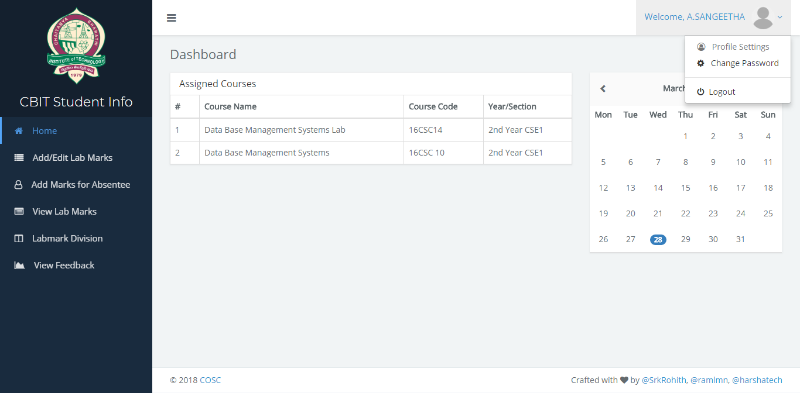
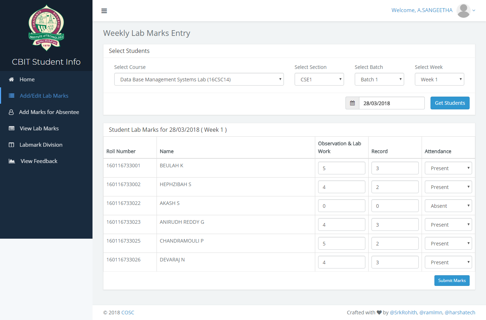
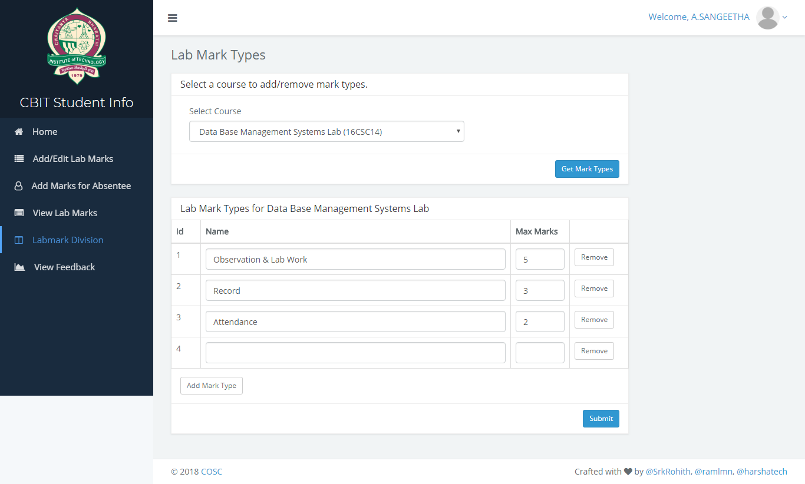
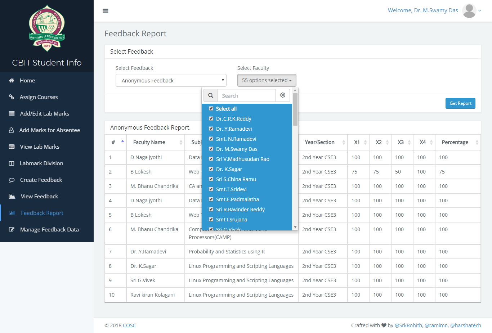
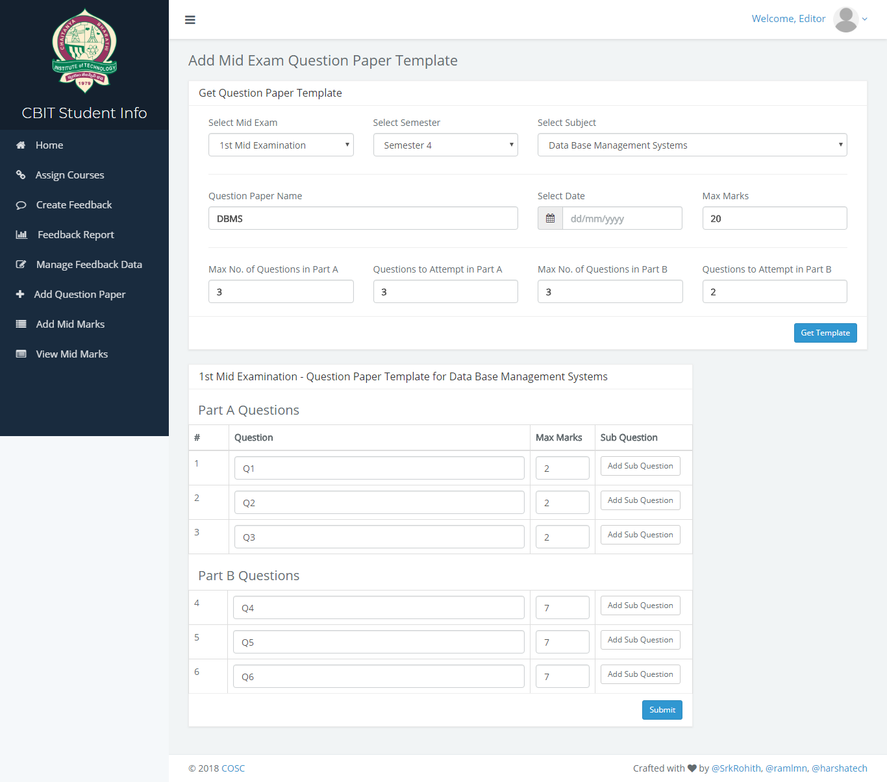
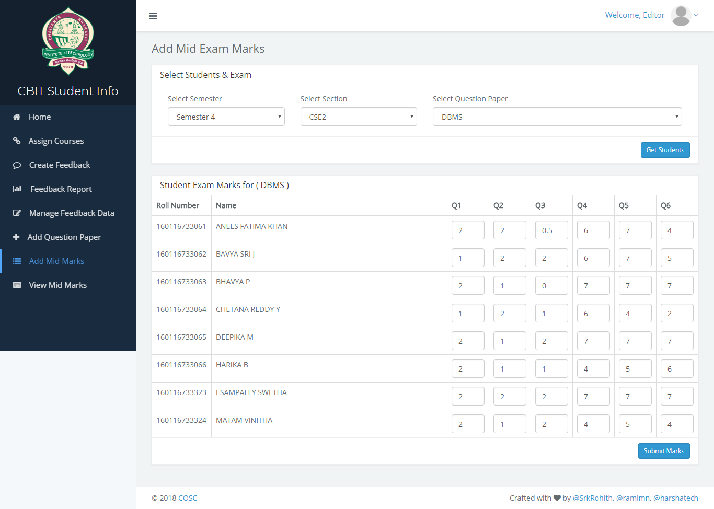
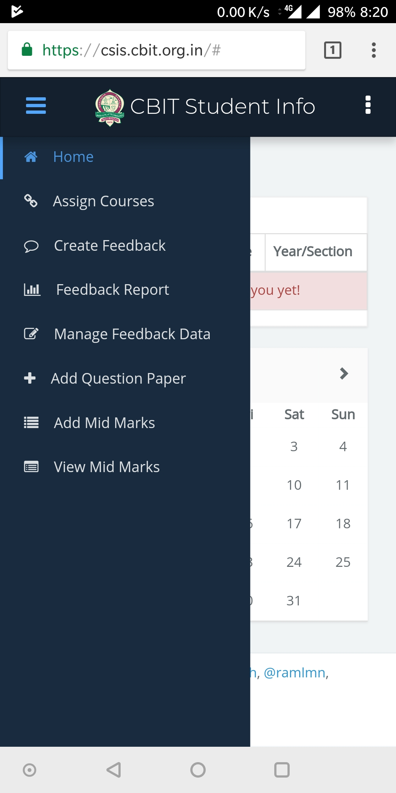

# CBIT Student Information System (CSIS)

A Laravel backed web application created in house at CBIT to make the internal
evauation of students easier.

## Modules
* [Lab evaluation](#lab-evaluation)
* [Feedback](#feedback)
* [Results](#results)

## Evaluation

Evaluation for the labs are done following the process of *Continuous Internal Evaluation*
(CIE), which is a day based process of evaluating students based on their
performance for the day on which the lab is conducted.

### Process for CIE

* **Creating a record for the day of conducting lab**

  A new record marking that a lab is conducted is created. This record is then
  used to track and assign marks for the students.

* **Adding marks for each student**

  After creating an entry for the day on which the lab is conducted, then an
  operator starts adding marks for each student of that batch. Marks are
  assigned for each category like record submission, attendance etc.

* **Adding marks for absent students**

  Students absent for a lab can gain marks for specific purposes for the
  previous labs conducted by meeting the requirements. The requirements include
  tasks like completion of previous lab tasks and record submission etc. But
  marks for absence are never alloted.

## Feedback

> _**Note**: Module in development_

Feedbacks for lecturers are provided by students only and the stats of the
feedback can be viewed by lecturers. A student can submit feedback anonymously.

Feedback reports are categorized based on classes and reports are collected on
various requirements. Feedback requests are created by _editor_, and the
students are then asked to provide feedback. These feedbacks are created and
edited by an _editor_.

## Results

> _**Note**: Module in development_

Results for the lab evalutation and marks for various tests/exams can be viewed
by students. This allows students to cross check marks with their questions.

Marks for mid exams are entered and managed by the _editor_.

### Teacher User Interface Screenshots

### Head of Department User Screenshots

### Editor User Interface Screenshots

### Mobile View

